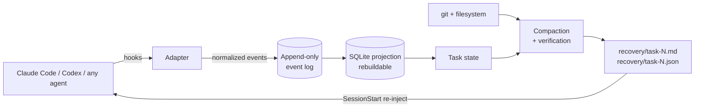

<div align="center">

# agent-state

**Your AI coding session just ran out of context. Continue exactly where it stopped, verified against your repo, in seconds.**

Local-first working memory, recovery and control for AI coding agents.<br>
Works with **Claude Code**, **Cursor**, **Gemini CLI**, **Codex** and **Aider**, and agent-agnostic by design.

[](https://github.com/Alejovar/agent-state/actions/workflows/ci.yml)
[](https://www.npmjs.com/package/agent-state)
[](LICENSE)


<sub>Claude Code screens are a re-creation; every agent-state output in the demo is real, produced through the actual hooks.</sub>

</div>

## What it does

agent-state runs next to your coding agent and keeps the task's working memory, so you never have to re-explain your work.

- 🔁 **Never lose a task.** When the context fills up or you open a new session, the agent gets back the objective, progress, decisions, failures and next step, verified against git.
- 🧷 **Long sessions stay sharp.** Right before the agent edits a file, it is reminded of the decisions and failed approaches tied to it. Before quality drops, you're offered a clean restart that keeps the task.
- 🔀 **Out of quota? Keep going.** When Claude hits its usage limit, the task continues in Codex or Gemini CLI with the full context.
- 🔍 **Review the agent's work in 30 seconds.** What was asked, what changed, why, and how it was verified, with flags for skipped tests, silenced errors, new dependencies and more.
- 💾 **Undo safely.** Checkpoints of uncommitted work, restored with a preview and an automatic backup.

Local only, no telemetry, secrets redacted before anything is written. Works with **Claude Code**, **Cursor**, **Gemini CLI**, **Codex** and **Aider**, on Linux, macOS and Windows.

## Quickstart

```bash
npm install -g --allow-git=all github:Alejovar/agent-state   # Node ≥ 22.13, no native deps
cd your-project
agent-state init        # detects Claude Code, Cursor, Gemini CLI, Codex and Aider, and hooks into each
```

> The npm release (`npm install -g agent-state`) is coming in a few days. Until then, install from GitHub as shown above.

That's it: keep working with your agent as usual. Type `agent-state` anytime to see where things stand, `agent-state review` to check the agent's work, and `agent-state uninstall` to remove everything it installed.

<details>
<summary><b>Prefer a Claude Code plugin?</b></summary>

```text
/plugin marketplace add Alejovar/agent-state
/plugin install agent-state@agent-state
```

The plugin forwards hooks to the `agent-state` CLI (install it with npm) and stays silent in projects without `.agent-state/`. With the plugin, set up each project with `agent-state init --no-hooks` (plain `init` would also install project hooks and every event would be recorded twice).
</details>

Lost a session anyway?

```bash
agent-state continue     # finds the latest unfinished task, verifies it, shows what will be restored, starts Claude with it
```

## How it works



1. **Adapters** turn agent-specific signals (Claude Code hooks, Codex `notify`) into normalized events: `USER_REQUEST`, `FILE_MODIFIED`, `TEST_FINISHED`, `DECISION_RECORDED`, and so on. Secrets are redacted **before** anything touches disk.
2. **Tasks are independent from sessions.** Task `#184` can span sessions `#184-A`, `#184-B` and `#184-C`, even across different agents.
3. **Compaction** folds a task's events into a compact state, prioritized as unfinished work, objective, decisions, errors, files, failures, tests, dependencies and next actions. It is rendered inside a byte budget (6 KB by default).
4. **Recovery** rebuilds that state against the repository *as it is now* and reports every conflict:

```text
## ⚠ Recovery state conflicts (repository is the source of truth)
- Branch changed since the recovery state was saved. (recorded: main → current: feature/other)
- 1 commit(s) since the recovery state: 9f2c1e0 rewrite google (recorded: d8164df2a1 → current: 9f2c1e0b77)
- Referenced file no longer exists: src/auth/callback.ts
```

This is what a recovered session receives (real output, 1.4 KB, generated without any LLM call):

```text
# RECOVERY CONTEXT — Task #1
**Objective:** Implement Google OAuth authentication with Redis sessions

## Next recommended action
? Continue: OAuth state expiration handling
## In progress
- [~] OAuth state expiration handling
## Pending
- [ ] Integration tests
## Known issues / current errors
• OAuth callback fails when OAuth state expires
• Tests failing: `npm test` (1 failed, 22 passed)
## Important decisions
• #1 Use Redis-backed sessions instead of JWT — Existing infra already provides Redis. Rejected: JWT, Database sessions.
## Changed files (2)
✓ A src/auth/callback.ts
✓ M src/auth/session.ts
```

### Long sessions stay sharp

Around the two-hour mark, long sessions degrade: the agent forgets earlier decisions and writes code that contradicts what it did an hour ago ("context rot"). agent-state works against that in two ways:

- **Just-in-time reminders.** Right before the agent edits a file, agent-state hands it the decisions, failed approaches and open issues linked to that file. Before it reruns a command that failed, it gets the reason. Each reminder is delivered once per context, costs a few lines, and never blocks anything:

  ```text
  [agent-state] Reminder before editing src/session.ts:
  - decision #1: Keep server-side Redis sessions; do not switch to JWT (because tokens cannot be revoked on logout). Rejected: JWT.
  ```

  In our live test, asked only to make `session.ts` "simpler and more scalable", Claude kept Redis and explained that it was aligning with the decision against JWT.
- **Fresh start at the right time.** At 60% of the context budget, agent-state saves the task state and suggests `/clear` (or run `/fresh` yourself). The new context starts with ~1.5 KB of verified state instead of 120k tokens of old conversation: better answers, fewer tokens.

The agent is also told, once per session, to record decisions and failed approaches (`agent-state decide` / `agent-state note tried`). `init --claude` allows exactly those two commands so they run without a permission prompt; they only write to `.agent-state/`.

### Out of Claude quota? Keep going in another agent

When Claude Code stops on its usage limit, agent-state saves the task on the spot and pops a desktop notification. `agent-state continue` then opens **Codex** or **Gemini CLI** (whichever is installed; each has its own quota) with the full task context and a note that it is taking over. When your limit resets, `agent-state continue --agent claude-code` brings everything back, including what the other agent did.

### Review what the agent did in 30 seconds

Reading code you didn't write is now the bottleneck. `agent-state review` (or `/brief` in Claude Code) turns the task into a review brief: what was asked, what changed, why (decisions, dropped approaches), how it was verified, and where to look closely.

```text
## Look closely at
- 🔴 `tests/auth/oauth.test.ts` skips a test
- 🔴 tests fail: `npm test` (1 failed)
- 🟡 `src/auth/oauth.ts` silences the TypeScript compiler
- 🟡 `src/auth/oauth.ts` swallows an error silently
- 🟡 `src/auth/session.ts` 8 files depend on it

## Suggested review order
1. `tests/auth/oauth.test.ts` — +2 −0, new
2. `src/auth/oauth.ts` — +5 −0, new, 1 dependent(s)
3. `src/auth/session.ts` — +1 −0, modified, 8 dependent(s)
```

It is deterministic (git + recorded activity). The flags are heuristics that point your attention; they are not verdicts. `--out review.md` gives you Markdown to paste into a pull request.

### Evidence levels: guesses are never presented as facts

| Mark | Meaning |
|---|---|
| `✓` | **verified**: checked against git or the filesystem while generating |
| `•` | **recorded**: observed as an event (tool call, test run, note) |
| `?` | **inferred**: derived by a deterministic heuristic |
| `~` | **AI**: produced by an optional AI provider, clearly labelled |

**Deterministic first, AI second.** Diffs, file changes, test results, dependency changes, imports and impact are computed without an LLM. AI is optional and only ever *adds* labelled summaries. Everything works with no provider configured.

## Features

| | Command | What it does |
|---|---|---|
| 🔀 | `continue` (auto handoff) | When Claude hits its usage limit, the task continues in Codex or Gemini CLI with full context |
| 🔍 | `review` · `/brief` | Review brief: asked / changed / why / verified, with risk flags (skipped tests, silenced checks, swallowed errors, credentials, new deps, CI changes) and a review order |
| 🧷 | reminders · `/fresh` | Related decisions and failed approaches surface right before the agent edits a file; a clean restart is suggested before long contexts degrade |
| 🧠 | `compact` · `recover` · `continue` · `handoff` | Compact state → verified recovery → resume the agent. Also available as `/recover` and `/handoff` in Claude Code |
| 💾 | `checkpoint` · `checkpoints` · `restore` | Snapshots of the working tree, staged changes, untracked files and task state, stored as private git objects. Restore shows a dry-run and conflicts, asks first, and **takes an automatic backup** so a restore can be undone. It never moves HEAD |
| 🗺 | `changes` | Change map: direct, created, deleted, **indirectly affected** (via the import graph), tests, config, infra, docs, dependency diffs |
| 💥 | `impact <file> [--symbol name]` | Transitive importers, **which functions use each exported symbol and where**, covering tests, affected routes, config references. Built-in parser, or tree-sitter when `@vscode/tree-sitter-wasm` is installed |
| 🔎 | `index [query]` | Incremental project index: languages, frameworks, databases, services, entrypoints, modules, APIs, infra, tests. Concept search (`index authentication` finds `session.ts`) |
| 📜 | `history` · `replay` · `sessions` | Search activity by keyword, file, task, session, date or type. Replay a session as request → actions → files → tests → decisions → result |
| 🧭 | `decide` · `decisions` · `why <file>` | Decision ledger. `why` links a file to its decisions, tasks, originating requests and commits |
| 🚧 | `scope` | Task contracts (intent ledger): allowed/restricted globs, with a `warn`/`confirm`/`block` policy enforced on the agent's edits in real time |
| 🧪 | `drift` | Finds contradictions between CLAUDE.md or docs and the code: dead paths, missing scripts, wrong package manager, "uses JWT" when the repo uses Redis sessions |
| 🌳 | `worktrees` | Which task and agent is active in each git worktree (parallel agents) |
| 👥 | `share` · `team` · `recover --from` | Opt-in team sharing through your own git remote: recovery states and decisions only, never prompts or the event log, shown before sending |

<details>
<summary><b>Example: scope control</b></summary>

```text
$ agent-state scope init --allow "src/auth/**" --allow "tests/auth/**" --restrict "database/**" --policy block

# Claude tries to edit database/schema.sql. The PreToolUse hook denies it and tells Claude why:
#   agent-state scope policy: database/schema.sql matches restricted scope "database/**" of task #1.

$ agent-state scope check
⚠ SCOPE EXPANSION DETECTED

Task:
  #1

Unexpected files:
  docker-compose.yml

Declared scope did not include these files. Allow them with: agent-state scope allow <glob>
```
</details>

<details>
<summary><b>Example: impact analysis</b></summary>

```text
$ agent-state impact src/auth/session.ts
src/auth/session.ts  [source] defines createSession, destroySession

Used by:
  src/auth/google.ts
  src/middleware/auth.ts
  tests/auth/session.test.ts
    src/routes/login.ts (indirect, depth 2)
    src/routes/private.ts (indirect, depth 2)
      src/index.ts (indirect, depth 3)

Used where (tree-sitter):
  createSession 4 use(s)
    src/auth/google.ts:2 in googleLogin()
    src/auth/oauth.ts:2 in googleCallback()
    src/middleware/auth.ts:2 in requireAuth()
    tests/auth/session.test.ts:3 at module level

Tests:
  tests/auth/session.test.ts

Routes:
  GET    /account src/routes/private.ts
```
</details>

<details>
<summary><b>Example: context drift</b></summary>

```text
$ agent-state drift
CONTEXT DRIFT  [technology]

Documentation:  Authentication uses JWT tokens signed with a shared secret.
Observed:       No JWT dependency or files found; repository uses server-side sessions (dependency connect-redis)
Confidence:     90%
Relevant files: docs/architecture.md:3
```
</details>

## Claude Code integration

`agent-state init --claude` writes hooks to `.claude/settings.local.json` (use `integrate claude-code --shared` for the committed `settings.json`) and adds slash commands: `/fresh` `/brief` `/recover` `/handoff` `/checkpoint` `/restore` `/changes` `/impact` `/history` `/why` `/drift` `/index`.

| Hook | What agent-state does |
|---|---|
| `UserPromptSubmit` | records the request; the first prompt with no active task creates one |
| `PreToolUse` | enforces the task's scope policy on `Write`/`Edit`; tracks commands |
| `PostToolUse` / `PostToolUseFailure` | records file changes, commands, test results (pass/fail counts), the todo list |
| `PreCompact` | **saves a verified recovery state before Claude compacts** |
| `SessionStart` (`compact`/`resume`/`clear`) | **re-injects the recovery context** so Claude continues with its memory intact |
| `SessionStart` (`startup`) | a one-line notice if a task is unfinished (configurable: `full`/`brief`/`off`) |
| `PreToolUse` (reminders) | adds the decisions / failed approaches linked to the file being edited, or why a command failed last time |
| `Stop` | estimates context pressure; at 60% saves the state and suggests `/clear`, at 94% generates recovery |
| `SessionEnd` | leaves a fresh recovery state behind |
| `StopFailure` (`rate_limit`) | saves the task and sends a desktop notification: continue in another agent with `agent-state continue` |

It uses documented hook events only. Anything uncertain, such as the token estimate read from the transcript, is isolated in the adapter and degrades to "unknown". Hooks take roughly 50–75 ms (mostly Node.js startup) and stay flat as history grows; never block the agent on errors (errors go to `.agent-state/reports/hook-errors.log`) and never interrupt it unless you pick the `block` scope policy.

**Help the next session:** Claude (or you) can record the things that matter most:

```bash
agent-state decide "Use Redis sessions instead of JWT" --reason "Redis already deployed" --rejected JWT
agent-state note issue "Callback fails when OAuth state expires"
agent-state note tried "Signed-cookie state: broke on Safari"
agent-state note next "Add TTL to OAuth state keys"
```

## Other agents

| Agent | Setup | What is captured |
|---|---|---|
| **Cursor** | `agent-state init --cursor` → `.cursor/hooks.json` | prompts, file writes/edits/deletes, shell commands with exit codes, tests, subagents. `preCompact` saves state with the **exact** context usage and the next tool result carries it back. Scope policy enforced on edits |
| **Gemini CLI** | `agent-state init --gemini` → `.gemini/settings.json` | prompts, `write_file`/`replace`, `run_shell_command` (exit codes, tests), `write_todos`. `PreCompress` saves state and the next turn re-injects it; `SessionStart` (`resume`/`clear`) injects it too. Scope policy enforced on edits |
| **Codex CLI** | `notify = ["agent-state", "hook", "codex"]` in `~/.codex/config.toml` | turns and requests; file changes come from git |
| **Aider** | nothing to install | Aider has no hooks, so its chat history (`.aider.chat.history.md`) is imported incrementally whenever you run a command: sessions, requests, edits, commands. `continue --agent aider` opens Aider with the recovery context as a read-only file (`--read`) |
| **Anything else** | `agent-state event FILE_MODIFIED --json '{"path":"src/a.ts"}' --agent aider` | whatever you send; `agent-state recover --agent generic` prints plain-text context |

Every hook-based adapter is a thin translation layer over one shared, agent-neutral session core ([`session-core.ts`](src/adapters/session-core.ts)). Adding an agent means mapping its payloads, not re-implementing recovery. PRs are welcome.

## Share a task with your team (opt-in)

```bash
agent-state share --dry-run     # shows exactly which files would be sent
agent-state share               # pushes refs/agent-state/shared/<you> to your git remote
agent-state team                # a teammate lists what people shared
agent-state recover --from alex 1   # …and hands alex's task #1 to their agent
```

Nothing is shared automatically. Only recovery states and decisions travel, in a private ref on the project's own remote (your branches are never touched, no third-party server). Verbatim prompts, free-form notes and the event log never leave your machine.

## Privacy & security

- **Local only.** No telemetry, no account, no uploads. State lives in `.agent-state/` (gitignored automatically).
- **Secret redaction before persistence:** API keys (Anthropic, OpenAI, GitHub, GitLab, Slack, Stripe, AWS, Google, npm, HF…), JWTs, bearer tokens, private keys, URL credentials, connection strings, `PASSWORD=`/`SECRET=`-style assignments and `--password` flags. Add your own patterns in `config.yaml`.
- File contents are never recorded, only paths, commands and output tails of failures.
- **AI is opt-in.** With a provider configured, every call prints what is being sent and to whom, and the payload is redacted first. Supported: `anthropic` (official SDK), `openai-compatible` (e.g. **Ollama for fully local AI**), or `command` (pipe to any CLI such as `claude -p`).

## Configuration

`.agent-state/config.yaml`:

```yaml
recovery:
  max_bytes: 6000          # hard budget for recovery context
  auto_inject: true        # re-inject after compaction/resume/clear
  inject_on_startup: brief # full | brief | off
context:
  window_tokens: 200000
  fresh_at: 0.60           # save state + suggest /clear before quality degrades
  compact_at: 0.94
reminders:
  enabled: true            # just-in-time reminders before edits
scope:
  policy: warn             # warn | confirm | block
redaction:
  patterns: []             # extra regexes
ai:
  provider: none           # none | anthropic | openai-compatible | command
```

## FAQ

**Isn't Claude Code's own `/compact` enough?**
Compaction is a lossy summary made by the model, inside one session. agent-state keeps a *structured*, *verified* state that survives across sessions, agents and machines. It re-checks that state against git, keeps decisions and failed approaches verbatim, and puts it back after compaction.

**How is this different from CLAUDE.md or memory files?**
Those are long-lived instructions you maintain by hand. agent-state tracks *task* state automatically: what changed, what failed, what's next. It even tells you when CLAUDE.md [has drifted](#features) from the code.

**Does it slow the agent down?**
Hooks append a JSON line and exit in roughly 50–75 ms, even with tens of thousands of recorded events. Heavier work (the SQLite projection, the index) happens lazily when you run a command.

**What if the saved state is wrong?**
The repository wins. Recovery re-verifies files, branch, HEAD and dependencies and prints conflicts at the top. Nothing is restored silently, and no project file is ever modified during recovery.

## Architecture & docs

- [docs/architecture.md](docs/architecture.md): data model, event schema, task/session model, recovery schema, compaction algorithm, storage, redaction, integration boundary
- Programmatic API: `import { Project, compactTask, recoverTask } from "agent-state"`

## Roadmap

- [x] Context recovery foundation: events, tasks/sessions, git, compaction, recovery, checkpoints
- [x] Project intelligence: index, dependency graph, impact, history, decisions, `why`
- [x] Agent control: task contracts, scope detection, warn/confirm/block
- [x] Context intelligence: drift, optional AI summaries, handoff, provider abstraction
- [x] Advanced agents: replay, multi-agent sessions and subagents, worktrees, Codex adapter
- [x] Cursor and Gemini CLI adapters
- [x] Aider adapter
- [x] Symbol-level impact (built-in parser, tree-sitter when installed)
- [x] Opt-in team sharing of recovery states

## Contributing

Issues and PRs are welcome. See [CONTRIBUTING.md](CONTRIBUTING.md). `npm test` runs the whole suite, against real temporary git repositories.

## License

[MIT](LICENSE)
